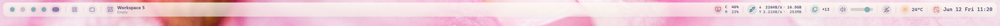

# zebar-rose-pine-dawn

Rosé Pine Dawn top bar pack for [Zebar](https://github.com/glzr-io/zebar).

[한국어](./README.ko.md)

## Previews

GlazeWM:


Komorebi:



## Features

- Top bar themed with the official [Rosé Pine Dawn palette](https://rosepinetheme.com/palette/).
- Full-width rail with modular workspace and system chips.
- System tray overflow popover, audio, network traffic, weather, date/time, and combined CPU/memory status.
- Optional Windows Night Light control through [`wnlctl`](https://github.com/lucidust/wnlctl).
- Local SVG icons bundled with the pack; no remote icon font dependency at runtime.

## Chips

Shared chips:

- CPU/memory and network traffic.
- System tray overflow.
- Volume.
- Windows Night Light, when `wnlctl.exe` is installed.
- Weather.
- Date and time.

GlazeWM integration:

- Workspace buttons.
- Focused workspace and window context.
- Binding mode, pause state, and tiling direction controls.

Komorebi integration:

- Workspace buttons.
- Focused workspace, container, stack, and window context.
- Layout, pause, tiling, stack, floating, maximized, and monocle focus status.

On non-primary monitors, live system stats are hidden to keep secondary bars lighter. This affects CPU/memory and network traffic.

## Variants

This pack ships three widget variants:

- `vanilla`: shared system status bar without WM-specific controls.
- `with-glazewm`: GlazeWM workspaces and WM status controls.
- `with-komorebi`: Komorebi workspaces, layout status, and focused container/window context.

## Install

### Marketplace

Install the pack from the Zebar marketplace and choose one of the shipped variants.

### Custom Widget

For development or local customization, clone this repository under your Zebar config directory and point Zebar at the local pack:

```powershell
git clone https://github.com/lucidust/zebar-rose-pine-dawn.git "$env:USERPROFILE\.glzr\zebar\zebar-rose-pine-dawn"
cd "$env:USERPROFILE\.glzr\zebar\zebar-rose-pine-dawn"
pnpm install
pnpm build
```

Zebar loads the generated `dist/` assets through `zpack.json`.

## Optional Night Light Helper

The Night Light chip requires `wnlctl.exe`. If `wnlctl` is not available on `PATH`, the Night Light control is hidden and the rest of the bar continues to run.

Install with Scoop:

```powershell
scoop bucket add lucidust https://github.com/lucidust/scoop-bucket
scoop install wnlctl
```

The pack uses only these helper commands:

```powershell
wnlctl status --json
wnlctl toggle --json
```

`wnlctl` is maintained separately at [lucidust/wnlctl](https://github.com/lucidust/wnlctl). That repository owns Windows registry access, release binaries, and helper-specific limitations.

## Recommended GlazeWM Setup

This pack is tuned around a 50px top bar region. A matching GlazeWM gap configuration is:

```yaml
gaps:
  scale_with_dpi: true
  inner_gap: '8px'
  outer_gap:
    top: '50px'
    right: '8px'
    bottom: '8px'
    left: '8px'
```

## Recommended Komorebi Setup

Use the `with-komorebi` variant when Komorebi is running and `komorebic.exe` is available to Zebar. The bar uses Zebar's Komorebi provider for live workspace data and `komorebic.exe state` to enrich focus state across tiling, stack, floating, maximized, and monocle workspaces.

The pack allows only these Komorebi helper commands:

```powershell
komorebic state
komorebic focus-monitor-workspace <monitor-index> <workspace-index>
```

The bar is tuned around the same 50px top region as the GlazeWM variant. Configure Komorebi work area or application gaps separately if you want windows to avoid the bar.

### Komorebi Debug Chip

The `with-komorebi` variant has a build-time debug chip for comparing Zebar provider state with `komorebic.exe state` polling. Enable it only for local debug builds by setting `VITE_KOMOREBI_DEBUG=1` before running `pnpm build`; it is disabled in normal builds and has no runtime toggle.

## Development

```powershell
pnpm install
pnpm validate:pack
pnpm typecheck
pnpm build
```

Useful files:

- `zpack.json`: canonical Zebar pack contract.
- `src/providers.ts`: provider wiring for each variant.
- `src/entries/*`: Vite entrypoints for shipped variants.
- `src/styles.css`: layout, spacing, and theme tokens.

## Notes

- Runtime UI strings and default widget labels are English.
- This pack is primarily tuned on a horizontal 4K monitor.

## License

MIT
